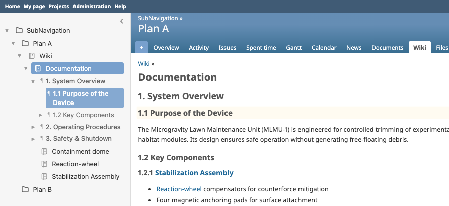
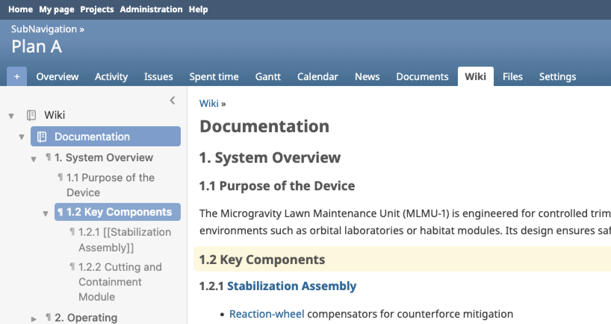
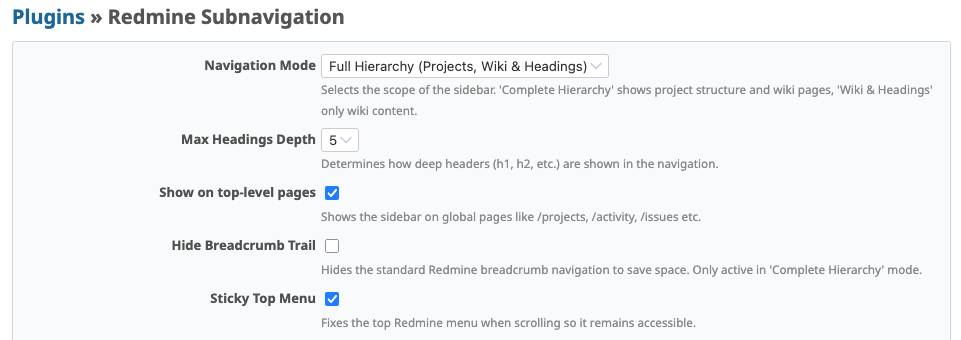

# Redmine Subnavigation Plugin


A Redmine plugin that adds a collapsible sidebar with a hierarchical navigation tree for projects, wiki pages, and headings — keeping the full structure visible without losing your place.

> Built for documentation-heavy teams who need context at a glance without switching pages.

## Screenshots





## Features

- **Project hierarchy**: navigate smoothly through projects and subprojects
- **Wiki tree**: visual tree of all wiki pages with expand/collapse
- **Headings TOC**: automatic table of contents (h1, h2, …) for the current page
- **Collapsible sidebar**: toggle to maximise workspace, state persists across page loads
- **Recursive expansion**: hold `Alt`/`Option` and click a triangle to expand or collapse all nested items at once
- **Cascading activation**: enabling or disabling the module in a parent project automatically applies to all subprojects (Full Hierarchy mode)
- **Optional breadcrumb hiding**: cleaner header without the default Redmine breadcrumb trail
- **Sticky top menu**: keep the main Redmine menu fixed while scrolling
- **Light & dark mode**: integrates with modern Redmine themes via CSS variables
- **Localised**: English and German included

## Requirements

- Redmine 5.0 or higher

## Installation

> [!IMPORTANT]
> The plugin directory **MUST** be named `redmine_subnavigation` for assets to load correctly.

1. **Clone** into your plugins directory:
   ```bash
   cd /path/to/redmine/plugins
   git clone https://github.com/subversive-tools/redmine_subnavigation.git redmine_subnavigation
   ```

2. **Run migrations**:
   ```bash
   bundle exec rake redmine:plugins:migrate RAILS_ENV=production
   ```

3. **Restart Redmine**.

## Configuration

Navigate to **Administration > Plugins > Subnavigation > Configure**.

| Option | Description |
|:---|:---|
| **Sidebar mode** | `Disabled` · `Wiki & Headings` (current project only, best for large instances) · `Full Hierarchy` (complete project tree) |
| **Max headings depth** | Deepest heading level shown in the automatic TOC |
| **Hide breadcrumb** | Hides the default Redmine breadcrumb trail (Full Hierarchy mode only) |
| **Sticky top menu** | Fixes the top menu bar when scrolling |

### Permissions

Go to **Administration > Roles and permissions** and enable *View subnavigation* for each role that should see the sidebar.

> [!NOTE]
> To show the sidebar to users who are not logged in, enable the permission for the **Anonymous** role. The **Non member** role applies only to logged-in users who are not project members.

> [!TIP]
> Hold **Alt / Option** while clicking an expand triangle to recursively expand or collapse all children at once.

## Contributing

Contributions are welcome — please fork the repository and open a Pull Request.

1. Fork it
2. Create your feature branch (`git checkout -b feature/my-feature`)
3. Commit your changes
4. Push to the branch
5. Open a Pull Request

## License

[MIT License](LICENSE) — Copyright (c) 2026 Stefan Mischke
